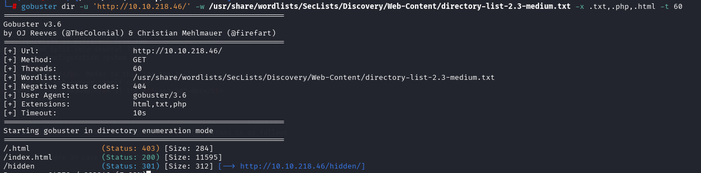
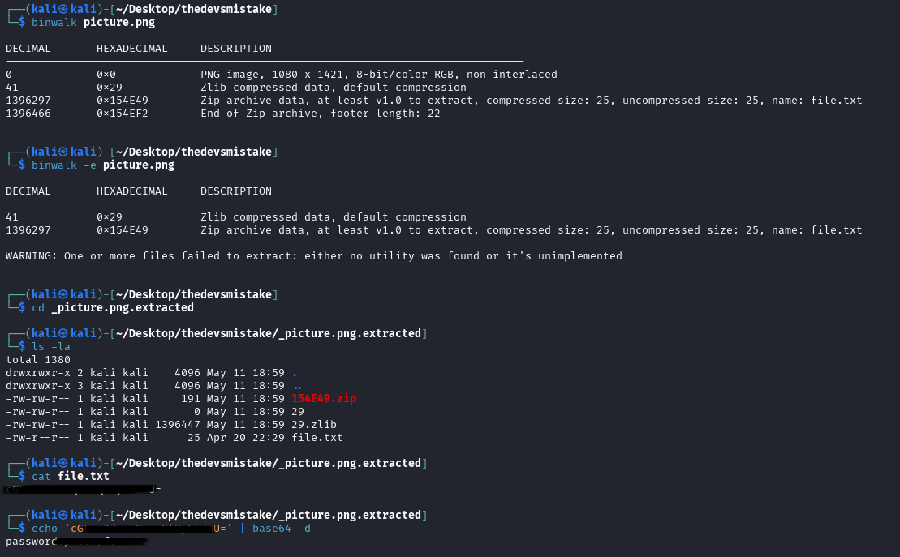
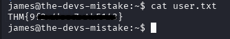
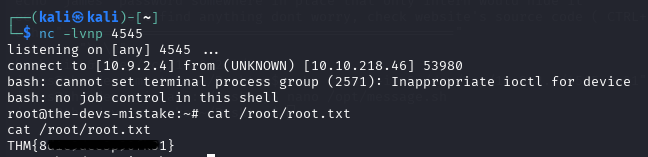

## Deploy machine

## Enumeration
By scanning open ports there are 3 open ports:
- FTP (21)
- SSH (22)
- HTTP (80)

We can log in as Anonymous into FTP (no password required).

Downloaded file but here was nothing interesting (literally nothing)

Okay, now let's have a look at http site, there is deafult apache website but looking at source code we can see a hint:

Used `gobuster` to enumerate directories and found a new one

Inside that directory we got a possible username:

In that path we found possible username:

Since here wasn’t much else to look at I ran gobuster again on the new directory

This time only found an image, I downloaded it and used binwalk to extract any embedded files. It extracted a text file containing base64 encoded text, after decoding it we got a password

## User flag

Now we have everything to access ssh and capture user flag

## Root flag

Found a cronjob running by root that runs every minute

There is permission to edit the script running, so I added a reverse shell command to that script and started a listener waiting for the connection

And finally

